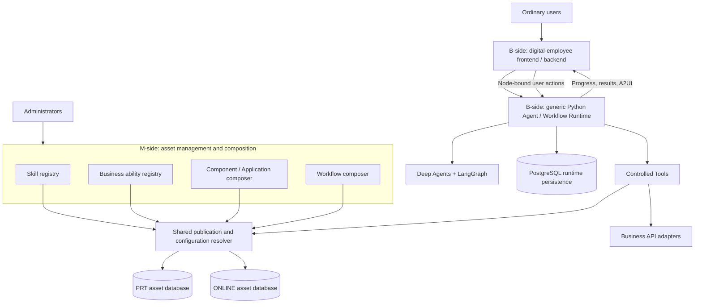

# SkillWeave Platform Architecture

[中文](architecture.zh-CN.md) · [Documentation](README.md) · [Project home](../README.md)

This guide explains SkillWeave's target architecture and confirmed product boundaries. Implementation status is a snapshot as of 2026-09-07 at source baseline `0e73d8b`: the Python Agent/Workflow engine is the current priority. The repository contains partial contracts, registry core modules, and framework experiments; the complete platform has not passed deployment acceptance. Target capabilities described below are not claims of shipped features.

## 1. Purpose

SkillWeave is a general-purpose platform for AI application developers. It manages reusable Skills, business abilities, and interactive interfaces, composes them into Workflows, and exposes conversation and task execution through a digital-employee product.

The platform addresses three needs:

- **Reuse:** the same Skill works in standalone conversation and in multiple Workflows.
- **Business-independent execution:** new scenarios use asset configuration, tool adapters, and product UI without adding scenario logic to the engine.
- **Controlled interaction:** the platform can verify business facts, required user interaction, versions, and authorization instead of relying solely on model compliance.

**M-side** means the management and configuration control plane, not mobile. **B-side** means the business product and execution side. These are responsibility boundaries; they do not require a separate deployed service for every module.

## 2. Architecture overview

Database and module nodes represent logical responsibilities and environment isolation requirements, not an inventory of deployed services. Physical runtime storage layout, API transport, and final service decomposition still require implementation and verification.

The product depends on generic Runtime contracts. The Runtime does not depend on digital-employee UI copy, business entities, or industry-specific processes.

## 3. Six product modules and shared foundations

| Module | Owns | Main output | Does not own |
| --- | --- | --- | --- |
| M: Skill registry | Metadata, instruction packages, scripts and reference resources, ability bindings, validation | Publishable Skill definitions and resource references | Model execution loops or fixed internal business flows for each Skill |
| M: business ability registry | Callable operations, input/output contracts, bindings, result policies | Ability definitions and execution interfaces consumed by the engine | Workflow scheduling or transactions inside business systems |
| M: A2UI composer | Component catalog, Application composition, parameter contracts, interaction modes, Action configuration | Publishable presentation and interaction definitions | Declaring an entire Skill or Workflow complete because a user clicked a UI element |
| M: Skill Workflow composer | Skill references, sequence, branching, parallelism, joins, graph validation | Workflow definitions | Translating a Skill's prose into a fixed business subgraph |
| B: digital-employee product | Conversation, Workflow sidebar, progress, A2UI hosting, node actions, business adaptation | User experience and trusted execution requests | Injecting business logic into the generic Runtime core |
| B: Agent/Workflow Runtime | Agent execution, graph execution, tool admission, interrupt/resume, results, persistence | Generic execution state, business facts, presentation events, final results | Asset editing, industry UI, or transaction coordination across business APIs |

Shared foundations cover asset identity, contracts, authorization, PRT/ONLINE publication, and userId-based rollout resolution. All four M-side platforms use them instead of implementing publication independently.

Phase 1 M-side backend work uses separate Python modules. Shared contracts use neutral schemas with a thin Python adapter package. Module boundaries do not imply one resident process per module; complete frontend applications and deployment topology have not been delivered.

## 4. Skills, abilities, Applications, and Workflows

### Skill: reusable AI instructions

A Skill describes objectives, constraints, resources, and execution guidance. Within those boundaries, the Agent uses context to choose authorized tool calls. Scripts and reference files are Skill resources; their presence does not grant unrestricted filesystem or command execution.

A Skill does not need Workflow-specific routing fields or a separately authored graph. Standalone conversation and Workflow nodes use the same Skill through `use_skill`.

### Business ability: a contract for a business operation

An ability adapts a concrete API into a callable operation with input, output, authorization, and result rules. Skills access it through `execute_ability`; the API backend owns the actual business effects.

For example, “save a draft” may be an ability. Its database transaction, business idempotency, and retry semantics belong to that business service, not the Workflow.

### Application: presentation and user interaction

Components are presentation building blocks. An Application composes them and defines parameters, interaction mode, and Action bindings. A Skill requests rendering through `render_application`; the digital-employee frontend hosts the actual presentation.

An Application may only display information or require a selection, form, or confirmation. Action success and completion of the current interaction are separate configured decisions.

### Workflow: a task composed of Skills

A Workflow places reusable Skills in a dependency graph with decisions, parallel branches, joins, and final summarization. The graph describes relationships between Skills; AI still executes each Skill according to its instructions.

## 5. From authoring to execution

This is the target collaboration flow. Current experiments do not yet cover the complete product path.

1. An administrator registers abilities and Applications, then creates Skills that reference them.
2. The administrator composes and validates a Workflow, then publishes it to PRT or ONLINE through shared publication.
3. A user selects a Workflow in the digital employee's conversation sidebar. The backend establishes trusted userId, environment, and operation ownership.
4. The Runtime resolves the effective Workflow configuration for that user, checks versions, and creates a new execution context.
5. LangGraph reaches a Skill node. The Agent loads authorized instructions and resources through `use_skill`.
6. The Skill calls abilities through `execute_ability` and produces A2UI through `render_application`.
7. If the Application requires interaction, the Runtime persists a waiting state. The user acts on that node's card, and the backend validates the action before continuation.
8. Configured rules evaluate the actual Action result. The Finalizer judges and summarizes the node within the constraints of real business facts and required interaction.
9. Successors consume predecessor final results and retrieve stored intermediate results when needed. The product presents the conclusion after joins and final summarization complete.

Transport, complete HTTP interfaces, streaming event formats, and product deployment entry points are not stable yet. This flow is not an executable API specification.

## 6. Python engine: Deep Agents and LangGraph

SkillWeave uses the [Deep Agents Python SDK](https://docs.langchain.com/oss/python/deepagents/overview) as the foundation for generic Agent execution, integrating platform Tools, context, and storage adapters through public extension points. The SDK itself uses LangGraph; this architecture distinguishes Agent execution capabilities from platform-level multi-Skill flows.

[LangGraph](https://docs.langchain.com/oss/python/langgraph/overview) provides actual graph execution and interruption. Its [persistence mechanisms](https://docs.langchain.com/oss/python/langgraph/persistence) support checkpoints. SkillWeave implements its confirmed authorization, version, interaction, join, and stop policies on top rather than adding a second replacement graph scheduler.

The platform must control the actual available tool surface. SDK integration does not automatically enable shell, filesystem, subagents, or native Skill-directory discovery. In the first version, authorized Skill body and resource loading enters through `use_skill`.

Current experiments use native Workflow branch subgraphs to investigate independent progression while another branch waits. These organize Workflow branches; they do not turn each Skill into a fixed business subgraph.

LangGraph's `thread_id` identifies persistent execution context. It is neither an operating-system thread nor an automatic distributed lock or guarantee of correct concurrent writes.

## 7. Tools and trusted execution

| Entry | Intended responsibility | Trust boundary |
| --- | --- | --- |
| `use_skill` | Resolve and load authorized Skill instructions and resources | No bypass of shared configuration resolution or model-selected identity |
| `execute_ability` | Invoke business operations using resolved ability contracts | Validate arguments, bindings, authorization, and actual results |
| `render_application` | Produce presentation/interaction from the effective Application definition | Apply configured interaction and result rules |
| Intermediate-result retrieval Tool, contract pending | Retrieve previously stored Tool results on demand | Read-only retrieval, not re-execution of business operations |

These names describe platform entry points; complete product API contracts are still being refined. userId, environment, credentials, and run ownership come from trusted backend context and are not freely chosen by the model.

Execution facts must originate in real Tool handlers. Model text or caller-supplied “successful Tool messages” alone cannot establish Finalizer success. Current experiments also verify merging concurrent Tool evidence within an invocation and preventing evidence inheritance by a new invocation. This is not acceptance of the complete product authorization chain.

## 8. A2UI and the node lifecycle

| Event or condition | Intended behavior |
| --- | --- |
| Render a DISPLAY_ONLY Application | Display content without pausing merely because a card exists |
| Render an INTERACTIVE Application requiring input | Persist waiting state for a user action belonging to that node |
| An Action fails configured business-success conditions | Preserve failure facts; do not declare interaction completion |
| An Action succeeds without a completion binding | Follow Application behavior without automatically advancing the Workflow |
| An Action succeeds with interaction completion configured | Complete that interaction, then apply node completion rules and Finalizer constraints |
| A node completes | Expose its final result and real status to successors and advance according to the graph |

Successful rendering, business Action success, interaction completion, Skill completion, and Workflow completion are separate boundaries. The Finalizer may reason and summarize but cannot contradict business facts or bypass required interaction. A successful submission response must not be reported as completion of a downstream asynchronous job.

Ordinary chat does not implicitly resume a Workflow. User input must belong to a specific node, card, or interaction; the model must not guess which waiting node owns it.

## 9. Routing, parallelism, and context

The first version covers sequence, conditional branches, and parallel branches. A separate AI decision node reads predecessor results and chooses one configured candidate; Skills do not change their output contracts for routing. If AI cannot decide semantically, a node-bound A2UI selection card presents configured choices. The user's selection determines the branch without AI reselection. Technical call failure is not automatically treated as semantic uncertainty.

Parallel branches follow these rules:

- While A waits for interaction, independent branch B may progress from B1 to B2. Paths dependent on A still wait.
- A join waits until its required branches satisfy their join conditions.
- Success, an explicitly permitted skip that actually occurred, or failure of an allow-skip node can satisfy the corresponding condition.
- Failure of a required node blocks the join. Tolerated failures retain their real status and reason.
- Permission to skip does not automatically skip a waiting node.

Downstream Skills and final summarization receive all predecessor final results and statuses by default. Stored intermediate Tool results are retrieved on demand instead of putting the entire execution trace into every prompt. Filtering, pagination, permissions, and context budgets still need engineering design. This context policy does not expose hidden model chain-of-thought.

Support for basic parallelism does not imply arbitrary cyclic graphs, complete nested-graph semantics, or distributed contention handling.

## 10. PRT, ONLINE, publication, and version changes

All asset types—Skills, abilities, components/Applications, and Workflows—use environment-separated database storage. In the first version, M and Runtime may each use one service deployment that distinguishes PRT/ONLINE through trusted request context; they need not be packaged together. B-side environments remain explicitly separate. PRT and ONLINE are SkillWeave's own logical environments.

| Request environment | Effective configuration | Rollout rule |
| --- | --- | --- |
| PRT | Current PRT version | Use current PRT definitions |
| ONLINE, outside rollout | ONLINE stable version | Shared resolver selects using trusted userId |
| ONLINE, selected for rollout | ONLINE gray version | Remains in the same ONLINE environment as stable |
| ONLINE, rollout complete | One serving ONLINE version | Stable and gray no longer serve side by side |

ONLINE serves at most a stable and a gray version simultaneously. Selecting an ONLINE user for rollout never reads PRT definitions or moves business operations to PRT.

Runs record configuration version identifiers for comparison. At execution, continuation, or Action ingress, an effective-version mismatch blocks continuation and asks the user to explicitly reset the Workflow. The first version does not continue using frozen old assets, migrate automatically, or replay business calls. Historical records may remain; archived definitions do not imply that old versions remain eligible for execution.

Cross-asset publication consistency, dependency validation, and physical storage layout must be completed by the shared publication design. This guide does not claim an implemented atomic publication guarantee.

## 11. Persistence, retries, stop, and restart

PostgreSQL is the only relational persistence choice for development, integration validation, and reference deployment. There are no MySQL or SQLite profiles. Asset definitions and execution records have different responsibilities; LangGraph checkpoints do not replace application authorization, version checks, or business facts.

| Control | Confirmed boundary |
| --- | --- |
| Continue after interaction | Resume using valid node interaction and checkpoints after identity, state, and version checks |
| Retry a node | First version: only A2UI rendering failure or A2UI Action failure/results failing configured conditions; preserve predecessors and independent branches |
| Other Skill failures | No generic model/script/non-A2UI Tool node-retry or precise internal recovery engine |
| Stop | Once accepted, all branches reject new nodes, model/Tool rounds, Workflow-affecting Actions, and retries; stopped runs cannot resume |
| Late result from an already-dispatched business call | Record the real outcome without successors, Finalizer execution, or changing the stopped run to success |
| Restart | Create a fresh execution from the entry without old context, checkpoints, results, or interactions; retain historical records |

Restart does not inspect old business outcomes, roll back, compensate, deduplicate across runs, or coordinate transactions. Business idempotency and retries belong to the called API backend. Platform requestId deduplication applies only to control requests and is not a business exactly-once guarantee.

An initial host may run several logical modules, but multi-instance correctness remains a design goal. A cross-process checkpoint experiment does not prove concurrent scheduling, conflict handling, disaster recovery, or high availability.

## 12. Permissions, memory, and knowledge

Ordinary users may browse management assets and use authorized digital-employee chat, Skills, Workflows, and cards. Administrators own asset creation, editing, publication, and script upload. Read-only management access does not make all business execution read-only. Real business writes exposed in a public demo still require scenario-specific decisions.

Context capabilities have three distinct scopes:

| Type | Purpose | Current boundary |
| --- | --- | --- |
| Conversation history | Messages and recorded context within a session | Not precise recovery at any arbitrary point inside a Skill |
| Personal long-term memory | User-related information across sessions | View/delete/disable in conversation settings, conditionally included if low cost |
| Knowledge retrieval | Retrieve information from documents or knowledge sources | Reuse mature components; product scope, ingestion, and authorization remain to be implemented |

Disabling long-term memory should stop its reads and new writes while preserving current conversation. Deleting memory does not delete chat history. Deep Agents extension capabilities do not build the platform's ingestion, permissions, index maintenance, or user-management interface for it.

## 13. Example scenarios: demonstration candidates

These independently created examples explain the architecture; they are not shipped features or final product commitments.

- **Research brief assistant:** gather public material → summarize evidence → let the user choose a focus → produce a brief. Demonstrates Skill reuse and on-demand context.
- **Project preparation assistant:** draft tasks and resource lists in parallel → obtain confirmation in one branch → join and summarize. Demonstrates independent progression and A2UI interaction.
- **Content planning assistant:** analyze a goal → let AI choose among configured plans → ask the user when uncertain → render results. Demonstrates a separate decision node.

Writes may initially use explicitly labeled synthetic data and adapters; real business-write permissions require a separate decision. The generic engine contains no business code for these scenarios.

## 14. Repository map and implementation status

| Path | Current contents | Does not establish |
| --- | --- | --- |
| `packages/contracts/` | Candidate schemas, Python adapters and validation for an approved subset | Stability of every shared protocol |
| `services/skill-registry/` | Skill resource, port, and use_skill core modules | A deployed registry UI and publication service |
| `services/capability-registry/` | Ability definition, binding, and result-policy validation core | Complete live connectors, authorization, and invocation chain |
| `packages/a2ui-contract-fixtures/` | Synthetic Application definitions and validators | Delivery of a complete editor and B-side Renderer |
| `experiments/runtime-phase1/` | Deep Agents/Tools/Finalizer/parallel/PG experiments | A deployable product Runtime |
| `openspec/changes/` | Domain proposals, tasks, contracts, and runtime evidence | Runtime acceptance merely because tasks are checked |
| `docs/` | Architecture and collaboration guides | Complete deployment and operations documentation |

The current Runtime records 31 passing experimental tests, including handler-owned evidence, rejection of forged messages, and concurrent Tool evidence merging. A separate bounded PostgreSQL two-process experiment demonstrated persisted interruption, independent branch progression, readback after exit, and resume to a join. It used synthetic data, not a live-model end-to-end workload.

The PG experiment found a temporary credential in an isolated log. The corrected source has not yet been rerun against PostgreSQL. Concurrent multi-instance conflicts, the complete product Action chain, retry/stop/restart, live-model execution, dependency distribution review, and deployment still have incomplete gates. Runtime therefore remains **NO READY**. See [Runtime readiness](../openspec/changes/oss-agent-workflow-runtime/readiness.md) and [regression evidence](../openspec/changes/oss-agent-workflow-runtime/regression.md) for details.

Suggested reading order:

1. This guide for responsibilities, execution, and environment boundaries.
2. [Phase baseline](../openspec/changes/skillweave-phase1/baseline.md) for confirmed requirements.
3. [Engine-first priority](../openspec/changes/skillweave-phase1/priority-engine-first.md) for implementation order.
4. [Runtime experiment guide](../experiments/runtime-phase1/README.md) for reproducible scope and dependencies.
5. [Workstreams](workstreams.md) and domain OpenSpec changes for collaboration.

Next steps prioritize a verifiable engine path and its essential contracts, followed by asset publication, the digital-employee UI, and independent demo scenarios, then product integration and multi-instance verification.
