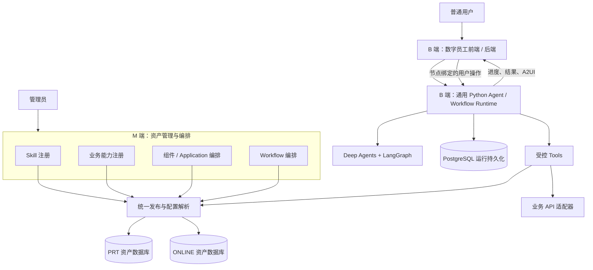

# A2Flow 平台架构

[English](architecture.en.md) · [文档目录](README.md) · [项目首页](../README.zh-CN.md)

本文介绍 A2Flow 的目标架构与已确认的产品边界。实现状态以 2026-09-07、源码基线 `0e73d8b` 为快照：当前优先建设 Python Agent/Workflow 引擎，仓库已有部分契约、注册核心模块和框架验证实验，完整平台尚未达到可部署验收状态。下文的目标能力不代表已经上线。

## 1. 项目定位

A2Flow 是一个面向 AI 应用开发者的通用平台：管理可复用的 Skill、业务能力和交互界面，将它们组合成 Workflow，再由数字员工产品提供对话与操作入口。

平台希望解决三个问题：

- **能力复用**：同一个 Skill 可以独立用于对话，也可以被多个 Workflow 引用。
- **运行与业务解耦**：新增业务场景通过资产配置、工具适配和产品界面完成，不把场景逻辑写进引擎。
- **可控制的交互执行**：业务事实、用户交互、版本与权限约束可以被运行平台验证，不能只依赖模型自行遵守。

文中的 **M 端**指管理与配置控制面，不指移动端；**B 端**指业务产品与执行侧。它们是职责边界，不意味着每个模块都必须独立部署为一个服务。

## 2. 架构总览

图中的数据库和模块表示逻辑职责与环境隔离要求，不是已部署的服务清单。运行数据的物理数据库布局、API 传输协议和最终服务拆分仍需实现与验证。

业务产品依赖 Runtime 的通用契约；Runtime 不依赖数字员工的页面文案、业务实体或具体行业流程。

## 3. 六个产品模块与共享基础能力

| 模块 | 负责什么 | 主要输出 | 不负责什么 |
| --- | --- | --- | --- |
| M：Skill 注册平台 | Skill 元信息、指令包、脚本与参考资源、能力绑定、校验 | 可发布的 Skill 定义与资源引用 | 执行模型循环、编排每个 Skill 的内部固定流程 |
| M：业务能力注册平台 | 可调用业务操作、输入输出契约、绑定与结果策略 | 引擎可使用的能力定义与执行接口 | 自行承担 Workflow 调度或业务系统内部事务 |
| M：A2UI 组件编排平台 | 组件目录、Application 组合、参数契约、交互模式与 Action 配置 | 可发布的展示与交互定义 | 根据前端点击直接宣布整个 Skill 或 Workflow 完成 |
| M：Skill Workflow 编排平台 | 引用 Skill，配置顺序、分支、并行与汇合，校验图结构 | Workflow 定义 | 将 Skill 的自然语言步骤翻译成固定业务子图 |
| B：数字员工产品 | 对话入口、Workflow 侧栏、进度、A2UI 展示、节点操作和业务适配 | 面向用户的体验及可信执行请求 | 把业务逻辑注入通用 Runtime 核心 |
| B：Agent/Workflow Runtime | Agent 执行、图运行、工具准入、暂停继续、结果与持久化 | 通用执行状态、业务事实、展示事件与最终结果 | M 端资产编辑、行业页面、跨业务 API 的事务协调 |

共享基础能力覆盖资产身份、契约、权限、PRT/ONLINE 发布与 userId 灰度解析。四个 M 平台共同使用这些能力，避免各自实现一套发布逻辑。

首阶段 M 后端采用独立 Python 模块，公共契约采用中立 schema 与薄 Python 适配包。模块边界不等于“一模块一个常驻进程”；完整前端和部署拓扑尚未交付。

## 4. Skill、业务能力、Application 与 Workflow

### Skill：可复用的 AI 指令包

Skill 描述目标、约束、可用资源和执行指导。Agent 在这些约束内根据上下文决定如何调用已授权的工具。脚本和参考文件是 Skill 的资源，不自动获得任意文件或命令执行权限。

Skill 不需要为接入 Workflow 增加专用路由字段或另外编写一个图。独立对话和 Workflow 节点都通过 `use_skill` 使用同一份 Skill。

### 业务能力：调用业务系统的契约

业务能力把具体 API 适配成有输入、输出、权限与结果规则的可调用操作。Skill 通过 `execute_ability` 访问它，实际业务副作用仍由对应 API 后端处理。

例如“保存一份草稿”可以是业务能力；其数据库事务、业务幂等和重试语义由该业务服务负责。Workflow 不接管这些事务。

### Application：数据如何展示、用户如何操作

组件是展示的构件；Application 组合组件，并描述输入参数、交互模式和 Action 绑定。Skill 通过 `render_application` 请求渲染，数字员工前端承载实际展示。

Application 可以是纯展示卡片，也可以要求用户选择、填写或确认。Action 调用成功与“完成当前交互”是分别配置的判断，不应被混为一谈。

### Workflow：组合多个 Skill 的任务流程

Workflow 把可复用 Skill 放在有依赖关系的图中，并加入判断、并行、汇合与最终汇总。图描述 Skill 之间的关系；Skill 内部仍由 AI 根据指令执行。

## 5. 从配置到执行的一条完整链路

以下是目标链路，用来说明模块合作关系；当前实验尚未覆盖完整产品闭环。

1. 管理员注册业务能力和 Application，创建引用它们的 Skill。
2. 管理员编排 Workflow，经校验后通过统一发布能力发布到 PRT 或 ONLINE。
3. 用户在数字员工对话侧栏点击一个 Workflow。后端确定可信的 userId、环境和操作归属。
4. Runtime 解析当前用户生效的 Workflow 配置，检查版本，建立新的运行上下文。
5. LangGraph 推进到 Skill 节点；Agent 经 `use_skill` 获取允许使用的指令与资源。
6. Skill 通过 `execute_ability` 执行业务能力，通过 `render_application` 产生 A2UI。
7. 若 Application 要求交互，持久化等待状态；用户从该节点卡片提交操作，后端校验后继续。
8. 配置规则评价实际 Action 结果。Finalizer 在真实业务事实和交互完成约束之内判断、总结节点结果。
9. 后续节点读取前序最终结果，按需检索保存的中间结果；汇合与最终汇总完成后，产品展示运行结论。

传输协议、完整 HTTP 接口、流式事件格式和产品级部署入口尚未稳定，不应把此流程图当作可直接调用的 API 文档。

## 6. Python 引擎：Deep Agents 与 LangGraph

A2Flow 使用 [Deep Agents Python SDK](https://docs.langchain.com/oss/python/deepagents/overview) 作为通用 Agent 的基础，通过公开扩展点接入平台 Tools、上下文和存储适配。SDK 本身基于 LangGraph；这里的分工是“Agent 执行能力”与“平台多 Skill 流程”的不同层次。

[LangGraph](https://docs.langchain.com/oss/python/langgraph/overview) 承担 Workflow 的真实图执行与中断基础，[持久化机制](https://docs.langchain.com/oss/python/langgraph/persistence)承载检查点。平台在其上实现已确认的权限、版本、交互、汇合和停止规则，不另外搭建一套替代图调度器。

平台必须约束实际可用的工具集合。接入 SDK 不意味着默认开放 shell、文件系统、子 Agent 或原生 Skill 目录发现；第一版 Skill 正文与资源的授权入口统一为 `use_skill`。

当前实验探索了原生 Workflow 分支子图，以验证“一支等待、另一支继续”的行为。这里的子图用于 Workflow 分支执行，不是把每个 Skill 改成固定业务子图。

LangGraph 的 `thread_id` 是持久化执行上下文的标识，不等于操作系统线程，也不自动提供跨实例锁或并发写入正确性。

## 7. Tools 与可信执行边界

| 入口 | 目标职责 | 信任边界 |
| --- | --- | --- |
| `use_skill` | 解析并装载获授权的 Skill 指令与资源 | 不能绕过统一配置读取或由模型伪造身份 |
| `execute_ability` | 按已解析能力契约调用业务操作 | 校验参数、绑定、权限和实际结果 |
| `render_application` | 按生效 Application 定义生成展示/交互 | 使用配置的交互与结果规则 |
| 中间结果读取 Tool（契约待定） | 按需读取已经保存的 Tool 结果 | 只读检索，不重新执行原业务调用 |

这些名称表达平台入口，完整产品 API 契约仍在收敛。userId、环境、凭据和运行归属来自可信后端上下文，不能由模型自由选择。

运行事实需要由实际 Tool 执行路径产生。模型文本或调用方预置的“成功 Tool 消息”不能单独成为 Finalizer 的成功证据。当前实验也验证了同次调用中并发 Tool 证据合并，以及新调用不继承旧证据；这不是完整产品授权链的验收。

## 8. A2UI 与节点生命周期

| 事件或条件 | 目标行为 |
| --- | --- |
| 渲染 DISPLAY_ONLY Application | 展示内容，节点无需仅因卡片出现而暂停 |
| 渲染需要交互的 INTERACTIVE Application | 保存等待状态，等待该节点的用户操作 |
| Action 未满足配置的业务成功条件 | 保留失败事实；不能宣布交互完成 |
| Action 成功但未配置完成交互 | 按 Application 行为继续，不自动放行 Workflow |
| Action 成功且配置为完成交互 | 完成该交互，再由节点完成规则与 Finalizer 决定后续 |
| 节点完成 | 向后序提供最终结果和真实状态，并按图关系继续 |

“卡片展示成功”“业务 Action 成功”“交互完成”“Skill 完成”“Workflow 完成”是不同边界。Finalizer 可以判断和总结，但不能推翻业务事实或绕过必需交互。接口只表示提交成功时，也不能把下游异步任务描述为已经完成。

普通聊天不隐式恢复 Workflow。用户填写或选择的内容必须属于具体的节点、卡片或交互，多个等待节点之间不由模型猜测归属。

## 9. 路由、并行和上下文

首版范围包括顺序、条件分支和并行分支。独立 AI 判断节点读取前序结果，从配置的候选节点中选出一个；Skill 无需为此改变输出契约。AI 语义上不能判断时，展示节点绑定的 A2UI 选择卡，按用户选择路由，不再交给 AI 重选。技术调用失败不自动等同于语义不确定。

并行分支遵循：

- A 等待用户时，独立 B 分支仍可从 B1 推进到 B2；依赖 A 的路径继续等待。
- 汇合节点等待各所需分支满足汇合条件。
- 成功、明确允许且实际发生的跳过、允许跳过节点的失败，可以满足相应分支条件。
- 不允许跳过的节点失败会阻塞汇合；允许失败也保留真实失败状态与原因。
- “允许跳过”不表示自动跳过正在等待的节点。

后续 Skill 与最终汇总默认获得所有前序节点的最终结果和状态。中间 Tool 结果通过只读检索按需提供，避免把完整执行记录全部塞进提示词。具体筛选、分页、权限和上下文预算仍需工程设计。此处的上下文不包含需要对外展示的模型隐式思维链。

任意循环图、完整嵌套图行为与分布式竞争处理不因支持基本并行而自动获得支持。

## 10. PRT、ONLINE、发布与版本变化

所有资产类型——Skill、业务能力、组件/Application、Workflow——都使用环境分离的数据库存储。M 端与 Runtime 首版可各使用一套服务，通过可信请求上下文区分 PRT/ONLINE；这不要求两者共同打包部署。B 端环境明确分离。这里的 PRT/ONLINE 是 A2Flow 自己的逻辑环境。

| 请求所在环境 | 生效配置 | 灰度规则 |
| --- | --- | --- |
| PRT | PRT 当前版本 | 使用当前 PRT 定义 |
| ONLINE，未命中灰度 | ONLINE 稳定版本 | 由统一解析器根据可信 userId 选择 |
| ONLINE，命中灰度 | ONLINE 灰度版本 | 与稳定版本处于同一 ONLINE 环境 |
| ONLINE，灰度完成 | ONLINE 唯一生效版本 | 不再同时提供旧稳定与新灰度两个版本 |

ONLINE 同时最多提供稳定、灰度两个版本。ONLINE 用户绝不会因命中灰度读取 PRT 配置；灰度也不意味着把业务操作切到 PRT。

运行记录保存用于比较的配置版本标识。开始执行、继续运行或处理 Action 时发现生效版本不一致，应阻止继续并提示用户显式重置 Workflow。第一版不维护旧版本继续执行，不自动迁移或重跑业务调用。历史记录可以保留；存档定义不代表运行时仍可选择旧版。

不同资产的发布一致性、依赖校验以及物理存储布局需要由共享发布方案进一步落实，不在本文虚构已实现的原子发布保证。

## 11. 持久化、重试、停止与重新开始

PostgreSQL 是开发、集成验证和参考部署的唯一关系型持久化方案，不提供 MySQL 或 SQLite profile。资产配置与运行记录承担不同职责；LangGraph 检查点也不能替代应用权限、版本校验和业务事实记录。

| 控制行为 | 已确认的边界 |
| --- | --- |
| 交互后继续 | 基于有效节点交互与检查点继续，先校验身份、运行状态和版本 |
| 节点重试 | 首版仅支持 A2UI 渲染失败，或 A2UI Action 失败/结果未满足配置条件；保留前序和独立分支 |
| 其他 Skill 失败 | 不提供通用模型、脚本、非 A2UI Tool 的节点重试或精确内部恢复引擎 |
| 停止 | 停止被接受后，各分支不再准入新节点、模型/Tool 轮次、影响流程的 Action 和重试；停止后不可继续 |
| 已发出的业务调用晚到结果 | 记录真实结果，不推进后续，不触发 Finalizer，也不把停止状态改成成功 |
| 重新开始 | 从入口创建全新执行，不继承旧上下文、检查点、结果或交互；历史记录不因此删除 |

重新开始不检查旧业务成功与否，不做回滚、补偿、跨次运行去重或事务协调。业务幂等和业务重试属于被调用 API 后端。平台 requestId 去重仅针对控制请求，不能表述为业务“恰好执行一次”。

首台主机可以运行多个逻辑模块，但多实例正确性仍是设计目标。跨进程读取检查点的实验，不等于并发调度、冲突处理、容灾和高可用均已完成。

## 12. 权限、记忆与知识

普通用户可以浏览管理平台资产，在获授权的数字员工场景中对话、使用 Skill、启动 Workflow 和操作卡片；管理员才拥有资产创建、编辑、发布和脚本上传权限。管理端只读不意味着业务端所有操作只读。公开体验可执行哪些真实业务写操作，仍需具体场景确认。

上下文能力分为三个层次：

| 类型 | 用途 | 当前边界 |
| --- | --- | --- |
| 会话历史 | 同一会话中的消息与已记录上下文 | 不等于精确恢复任意 Skill 执行位置 |
| 用户长期记忆 | 跨会话保留用户相关信息 | 低成本时首版提供查看、删除、关闭，入口在会话设置 |
| 知识检索 | 从文档或知识来源检索信息 | 复用成熟组件；知识库产品范围、接入和授权仍待落实 |

关闭长期记忆应停止长期记忆读取与新增写入，同时保留当前对话能力；删除记忆不等于删除聊天历史。Deep Agents 的扩展能力并不替平台完成数据接入、权限、索引维护或用户管理界面。

## 13. 示例场景：用于解释架构的候选演示

以下为独立构造的演示建议，不代表已经实现或最终产品承诺：

- **资料简报助手**：收集公开资料 → 形成证据摘要 → 用户选择重点 → 输出简报，展示 Skill 复用和按需上下文读取。
- **项目准备助手**：并行生成任务草案和资源清单 → 用户确认其中一支 → 汇合总结，展示独立分支推进与 A2UI 交互。
- **内容计划助手**：分析目标 → AI 在候选计划中选路 → 不确定时请用户选择 → 生成结果卡，展示独立判断节点。

演示中的写操作可先采用明确标注的合成数据与适配器；真实业务写权限需要单独确定。通用引擎不包含这些场景的业务代码。

## 14. 仓库导览与实现状态

| 路径 | 当前内容 | 不能据此声称 |
| --- | --- | --- |
| `packages/contracts/` | schema 候选、已批准子集的 Python 适配与校验 | 所有共享协议均已稳定 |
| `services/skill-registry/` | Skill 资源、端口与 use_skill 核心模块 | 完整注册平台与发布服务已经上线 |
| `services/capability-registry/` | 能力定义、绑定及结果策略校验核心 | 真实业务连接器、权限与调用链全部完成 |
| `packages/a2ui-contract-fixtures/` | 合成 Application 定义及校验器 | 完整编辑器与 B 端 Renderer 已交付 |
| `experiments/runtime-phase1/` | Deep Agents/Tools/Finalizer/并行/PG 验证实验 | 可直接部署的产品 Runtime |
| `openspec/changes/` | 各域方案、任务、契约与运行证据 | tasks 完成即运行验收通过 |
| `docs/` | 架构说明和协作导览 | 产品部署与运维手册已经完整 |

当前 Runtime 的 31 个实验用例记录为通过，包括真实 handler 证据、伪造消息拒绝、并发 Tool 证据合并等验证。另有一次有范围限制的 PostgreSQL 双进程实验，验证中断持久化、另一分支推进、退出后读回与继续汇合；它使用合成数据，并非真实模型端到端执行。

PG 实验曾发现临时凭据进入隔离日志的问题；修正源码后尚未再次现场运行 PG 探针。并发多实例冲突、产品 Action 完整链路、retry/stop/restart、真实模型、依赖分发评审与正式部署仍有未完成门禁。因此 Runtime 当前结论仍为 **NO READY**。更细的事实见[Runtime readiness](../openspec/changes/oss-agent-workflow-runtime/readiness.md)与[回归记录](../openspec/changes/oss-agent-workflow-runtime/regression.md)。

推荐阅读顺序：

1. 本文理解职责、执行与环境边界。
2. [阶段基线](../openspec/changes/skillweave-phase1/baseline.md)阅读已确认要求。
3. [引擎优先级](../openspec/changes/skillweave-phase1/priority-engine-first.md)理解当前实施顺序。
4. [Runtime 实验说明](../experiments/runtime-phase1/README.md)查看可复现范围和依赖。
5. [工作流分工](workstreams.md)与各域 OpenSpec 查看后续协作入口。

后续推进先完成引擎与必要契约的可验证链路，再接入资产发布、数字员工界面和独立演示场景，逐步完成产品级集成与多实例验证。
